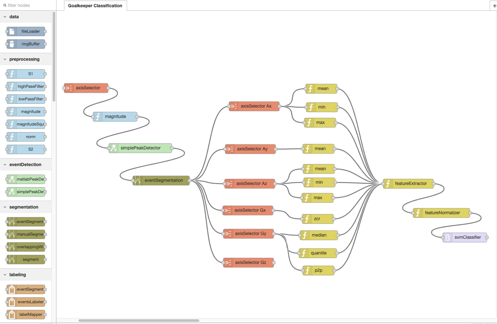
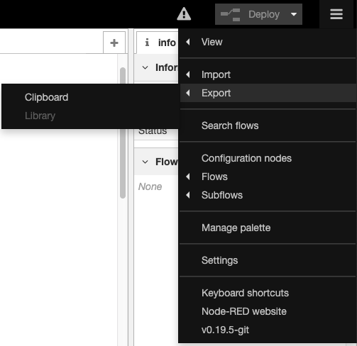

# Wearables Development Toolkit (WDK) - Visual Programming Platform

WDK-RED is a rapid prototyping platform for wearable device applications. Most wearable device applications use sensor data to extract information about the wearer and her context. This is done in a series of computations called the [Activity Recognition Chain (ARC)](https://github.com/avenix/ARC-Tutorial). Most of these computations are available as reusable Matlab components in the [Wearables Development Toolkit](https://github.com/avenix/WDK#application-development). WDK-RED wraps these computations in javascript objects that can be used within [Node-RED](https://nodered.org/).


# Setup
* * ```git clone https://github.com/avenix/WDK-RED.git```
* Install Node-RED as described in the [Node-RED GitHub page](https://github.com/node-red/node-redn).
* Install the WDK-RED nodes:
    1. Go to your Node-RED installation directory, usually ```cd ~/.node-red```
    2. Copy the nodes to your npm:  
```
npm install <WDK-RED.git>/1-data/*
npm install <WDK-RED.git>/2-preprocessing/*
npm install <WDK-RED.git>/3-eventDetection/*
npm install <WDK-RED.git>/4-segmentation/*
npm install <WDK-RED.git>/5-labeling/*
npm install <WDK-RED.git>/6-featureExtraction/*
npm install <WDK-RED.git>/7-classification/*
npm install <WDK-RED.git>/other/*
```
(you should replace <WDK-RED.git> by the path to your local copy of the WDK-RED.git repository.

* Run node-RED:
```
node-red
```

# Visual Programming

WDK-RED enables the creation of activity recognition applications by dragging reusable components (i.e. nodes) from the palette and connecting them together. The available nodes are documented in the [Wearables Development Toolkit documentation](https://github.com/avenix/WDK#application-development). The following image shows an activity recognition application for detecting and classifying soccer goalkeeper training exercises using a wearable motion sensor attached to a glove worn by a goalkeeper:



# Exporting

Activity recognition applications created with Node-RED can be exported over the settings button: 



Exported applications can be loaded and executed in the Wearables Development Toolkit as described [here](https://github.com/avenix/WDK#Development-with-Node-RED).


## References

1. Matlab tutorial on Activity Recognition for wearables: https://github.com/avenix/ARC-Tutorial/
2. Andreas Bulling's tutorial on Activity Recognition: https://dl.acm.org/citation.cfm?id=2499621
3. Wearables Development Toolkit: https://github.com/avenix/WDK

## About
My name is Juan Haladjian. I developed the WDK-RED platform as part of my post-doc at the Technical University of Munich. Feel free to contact me with questions or feature requests. The project is under an MIT license. You are welcome to use the code in this repository, extend it and redistribute it for any purpose, as long as you give credit for it by copying the *LICENSE.txt file* to any copy of this software.

Feel free to contact me with feedback or feature requests.

Website: [www.jhaladjian.com](https://www.jhaladjian.com)

Academic Website: [http://in.tum.de/~haladjia](http://home.in.tum.de/~haladjia/)

LinkedIn: [www.linkedin.com/in/juan-haladjian](https://www.linkedin.com/in/juan-haladjian)

Email: [haladjia@in.tum.de](mailto:haladjia@in.tum.de)
